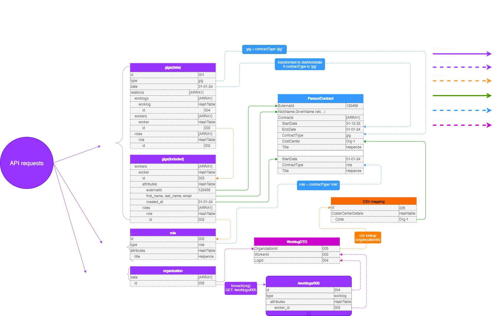

# HelloID-Conn-Prov-Source-Clevergig

> [!IMPORTANT]
> This repository contains the connector and configuration code only. The implementer is responsible to acquire the connection details such as username, password, certificate, etc. You might even need to sign a contract or agreement with the supplier before implementing this connector. Please contact the client's application manager to coordinate the connector requirements.

<p align="center">
  
</p>

## Table of contents

- [HelloID-Conn-Prov-Source-Clevergig](#helloid-conn-prov-source-clevergig)
  - [Table of contents](#table-of-contents)
  - [Introduction](#introduction)
  - [Getting started](#getting-started)
    - [Connection settings](#connection-settings)
  - [Remarks](#remarks)
    - [How to interpret the data](#how-to-interpret-the-data)
      - [Gig](#gig)
      - [Role](#role)
      - [Worker](#worker)
      - [Worklog](#worklog)
    - [CSV mapping](#csv-mapping)
    - [UML](#uml)
    - [The proces in-depth](#the-proces-in-depth)
      - [1. Import CSV mapping](#1-import-csv-mapping)
      - [2. Retrieve all roles](#2-retrieve-all-roles)
      - [3. Retrieve arganizations and worklogs](#3-retrieve-arganizations-and-worklogs)
      - [4. Retrieve worklogs per organization and filter on date range](#4-retrieve-worklogs-per-organization-and-filter-on-date-range)
      - [5. Retrieve gigs, associated data and filter on date range](#5-retrieve-gigs-associated-data-and-filter-on-date-range)
      - [6. Separate the gigs and associated data into lists](#6-separate-the-gigs-and-associated-data-into-lists)
      - [7. Gather all workers](#7-gather-all-workers)
      - [8. Process all workers](#8-process-all-workers)
      - [9. Retrieve worklogs and associate CostCenter details](#9-retrieve-worklogs-and-associate-costcenter-details)
      - [10. Get title information by looking up the `roleid` within the allRoles list](#10-get-title-information-by-looking-up-the-roleid-within-the-allroles-list)
      - [11. Construct the startDate and endDate](#11-construct-the-startdate-and-enddate)
      - [12. Complete person object with contract informtion](#12-complete-person-object-with-contract-informtion)
  - [Development resources](#development-resources)
    - [API endpoints](#api-endpoints)
    - [API documentation](#api-documentation)
  - [Getting help](#getting-help)
  - [HelloID docs](#helloid-docs)

## Introduction

_HelloID-Conn-Prov-Target-Clevergig_ is a _source_ connector. _Clevergig_ provides a set of REST API's that allow you to programmatically interact with its data. _Clevergig_ represents a system where gigs (tasks or jobs) are assigned to workers who fulfill specific roles. The work done on these gigs is logged in worklogs.

## Getting started

### Connection settings

The following settings are required to connect to the API.

| Setting                     | Description                                                                                                                 | Mandatory |
| --------------------------- | --------------------------------------------------------------------------------------------------------------------------- | --------- |
| ApiKey                      | The ApiKey to connect to the API                                                                                            | Yes       |
| BaseUrl                     | The URL to the API                                                                                                          | Yes       |
| HistoricalDays              | The number of days in the past from which the gigs will be imported                                                         | Yes       |
| FutureDays                  | The number of days in the future from which the gigs will be imported                                                       | Yes       |
| CSVMappingFile              | Specifies the file name (including the path) for the CSV mapping file that contains the CostCenter mapping                  | Yes       |
| CSVMappingDelimiter         | The delimiter used within the CSV mapping file to separate columns, ensuring the file can be parsed and processed correctly | Yes       |
| ReportOnNonExistingWorklogs | The delimiter used within the CSV mapping file to separate columns, ensuring the file can be parsed and processed correctly | No        |

## Remarks

### How to interpret the data

#### Gig

A gig represents a task or job. In this dataset, each gig can be related to multiple workers, roles, and worklogs.

The _gig_ data set is split into two arrays: <br> - Data (contains all the gigs) <br> - Includes (basic role, worker and worklog information.)

```json
{
  "data": [
    {
      "id": "001",
      "type": "gig",
      "attributes": {
        "id": 001,
        "bookmark": false,
        "created_by": "John Doe",
        "title": "First shift",
        "status": "",
        "description": null,
        "hidden_description": null,
        "workers_needed": 1,
        "parent_id": null,
        "created_at": "29-08-2024 12:15",
        "updated_at": "28-10-2024 14:39",
        "date": "26-10-2024",
        "organization_title": null,
        "start_at": "15:00",
        "real_finish_at": "23:00",
        "duration": 8,
        "shift_type": null,
        "timebreak": 0,
        "location_address": "",
        "location_description": null
      },
      "relationships": {
        "roles": {
          "data": [
            {
              "id": "002",
              "type": "role"
            }
          ]
        },
        "workers": {
          "data": [
            {
              "id": "003",
              "type": "worker"
            }
          ]
        },
        "worklogs": {
          "data": [
            {
              "id": "004",
              "type": "worklog"
            }
          ]
        }
      }
    }
  ],
  "included": [
    {
      "id": "002",
      "type": "role",
      "attributes": {
        "id": 1,
        "title": "Helpende"
      }
    },
    {
      "id": "003",
      "type": "worker",
      "attributes": {
        "id": 003,
        "first_name": "Emma",
        "last_name": "Brown",
        "phone": "",
        "email": "ebrown@enyoi",
        "status": "active",
        "external_id": 123456,
        "created_at": "2024-05-17T12:17:43.000Z",
        "updated_at": "2024-10-28T09:24:35.000Z",
        "short_description": null,
        "birthdate": null
      },
      "relationships": {
        "roles": {
          "data": [
            {
              "id": "002",
              "type": "role"
            }
          ]
        }
      }
    },
    {
      "id": "004",
      "type": "worklog",
      "attributes": {
        "id": 004,
        "worker_id": 003,
        "start_at": "15:00",
        "finish_at": "23:00",
        "status": "correct",
        "distance": "63.72",
        "signature_owner": null,
        "approved_by": null,
        "created_at": "2024-08-29T12:15:35.000Z",
        "updated_at": "2024-10-28T07:44:16.000Z",
        "placement_entity_id": null,
        "approver_type": null,
        "approver_id": null,
        "planner_distance": "63.72"
      }
    }
  ]
}
```

#### Role

A role represents the job position or responsibility a worker has within a gig. Each gig can have multiple roles, and a worker may hold several roles across different gigs. However, it's uncommon for a worker to hold multiple roles within the same gig.

```json
{
  "data": [
    {
      "id": "002",
      "type": "role",
      "attributes": {
        "id": 002,
        "title": "Helpende"
      }
    }
  ]
}
```

#### Worker

A worker is the individual assigned to complete a gig. A gig can have multiple workers.

> [!IMPORTANT]
> Worker information is only accessible within a gig through the [_included/workers/worker_](#gig) array.

```json
{
  "id": "003",
  "type": "worker",
  "attributes": {
    "id": 003,
    "first_name": "Emma",
    "last_name": "Brown",
    "phone": "",
    "email": "ebrown@enyoi",
    "status": "active",
    "external_id": 123456,
    "created_at": "2024-05-17T12:17:43.000Z",
    "updated_at": "2024-10-28T09:24:35.000Z",
    "short_description": null,
    "birthdate": null
  },
  "relationships": {
    "roles": {
      "data": [
        {
          "id": "002",
          "type": "role"
        }
      ]
    }
  }
}
```

#### Worklog

A worklog is a record that tracks the time a worker has spent on a gig, along with its status (such as approved or draft) and the approver’s information. In Clevergig, worklogs are linked to both workers and gigs, serving as the central object that connects gig, worker, and organizational data.

> [!IMPORTANT]
> Within the connector, worklogs are retrieved and filtered based on the `organizationId` from a CSV mapping.
> Worklogs are transferred to a _worklogDTO_ object containing the following:
> - `OrganizationId`
> - `GigId`
> - `WorkerId`

```json
{
    "id": "004",
    "type": "worklog",
    "attributes": {
        "id": 004,
        "worker_id": 003,
    }
}
```

### CSV mapping

An additional CSV mapping file is utilized to extract the `CostCenterCode`. The process involves: retrieving all worklogs for a specific organization, matching each worklog with the worker by checking the `worklogid` and `worker_id`. Upon a successful match, the `organizationId` is used to lookup the corresponding `CostCenterCode` within the CSV file.

```csv
Id;CostCenterCode
005;ORG-1
```
> [!WARNING]
> The `CostCenterCode` is only available if the contract is of type `gig`.

### UML

For a visual representation of the relationships between the different entities and a _HelloID_ person/contract, refer to the UML diagram below:



### The proces in-depth

#### 1. Import CSV mapping
- __Goal__: Import additional mapping to allow for lookups by `organizationid` to complete the contract information with the correct `CostCenterCode`.

#### 2. Retrieve all roles
- __Goal__: Retrieve all available roles to allow for lookups by `roleid` to complete the contract information with the correct `Title`. The roles are stored in the `allRoles` list.

#### 3. Retrieve arganizations and worklogs
   - __Goal__: Retrieve all organizations and their associated worklogs, then filter them based on a specified date range.
   - __Process__:
     - Retrieve all organizations using the `Invoke-ClevergigRestMethod` with the `organizations?` endpoint.
     - For each organization:
       - Retrieve the worklogs by calling the `worklogs?by_organizations` endpoint, applying the date range filters (`start_date` and `finish_date`).
       - For each worklog in the retrieved data:
         - Create a DTO object (`$organizationWorklogDTO`) containing the `OrganizationId`, `logId`, and `WorkerId`.
         - Add the DTO object to the `$allWorklogsDTO` list for further processing.

#### 4. Retrieve worklogs per organization and filter on date range
- __Goal__: Retrieve all worklogs for a specific organization and filter by a date range. The date range is determined by the days specified in the configuration settings:
  - `HistoricalDays`
  - `FutureDays`

#### 5. Retrieve gigs, associated data and filter on date range
   - __Goal__: Retrieve gigs along with their related roles, workers, and worklogs. The data is filter by a date range. The date range is determined by the days specified in the configuration settings:
  - `HistoricalDays`
  - `FutureDays`
   - __Data structure__:
     - `Data`: An array containing:
       - __id__: Unique identifier for each gig.
       - __type__: Type of data entry.
       - __attributes__: Contains details such as `status` and `date`.
       - __relationships__: Lists linked objects, including:
         - `roles`
         - `workers`
         - `worklogs`
     - `Includes`: An array containing basic information for:
       - `role`
       - `worker`
       - `worklog`

#### 6. Separate the gigs and associated data into lists
  - __Goal__: Separate the gigs and the included array into different lists for easier processing.

#### 7. Gather all workers
   - __Goal__: Build a list of all workers associated with each gig.
   - __Process__:
     - Loop through `gig.relationships.workers` to collect all workers.
     - For each worker:
       - Look up the `worker` object in `includes` by matching `id` and `type`.
       - Add each worker to a list for further processing.

#### 8. Process all workers
   - __Goal__: For every worker, build up the full `person` object.
   - __Process__:
     - For each worker:
       - Retrieve the gigs associated with them and lookup the worker details in the __includes__ array.
       - __Contract Details__:
         - __Duration__: Use the `date` field (start and end dates) of each gig as the contract period.
         - __Cost Center__: Derived from a CSV lookup based on `worklog/organization.id`.
         - __Title__: Retrieved from the roles data using `title.id`.

#### 9. Retrieve worklogs and associate CostCenter details
   - __Goal__: Retrieve all worklogs for a specific worker and gig, then associate the corresponding cost center details from a CSV mapping.
   - __Process__:
     - Loop through all `worklogsDTO` to find logs that match the `workerGig.relationships.worklogs.data.id` and `worker.workerId`.
     - For each matching worklog:
       - Add the worklog to the `$gigDTOWorklogs` list.
     - Retrieve the `organizationId` from the first matching worklog in the list.
     - If the `organizationId` is found:
       - Look up the corresponding cost center details in the `$costCenterCodes` CSV mapping file by matching the `organizationId`.
       - Extract the following cost center details:
         - `Id`
         - `Title`
         - `LocatiesAdressen`
         - `IntusResourceGroupId`
         - `FactureringKostenplaats`
       - Store the extracted details in the `$gigContract.CostCenterDetails` object for further processing.

#### 10. Get title information by looking up the `roleid` within the allRoles list
   - __Goal__: Retrieve the role information associated with a gig and set the gig contract title based on the role.
   - __Process__:
     - Check if the `gig.relationships.roles.data` is not null.
     - If roles are present:
       - Use the role ID from `gig.relationships.roles.data[0].id` to find the matching role in the `allRoles` list.
       - Set the `Title` of the `$gigContract` to the `title` attribute of the matching role.

#### 11. Construct the startDate and endDate
   - __Goal__: Set the start and end dates for the gig contract based on the worker gig's date.
   - __Process__:
     - Parse the `workerGig.attributes.date` using the format `"dd-MM-yyyy"` to set the `StartDate` of the `$gigContract`.
     - Set the `EndDate` of the `$gigContract` to one day after the `StartDate`, subtracting one second to ensure it reflects the end of the day.

#### 12. Complete person object with contract informtion
   - __Goal__: Create the contract objects for both the _gig_ and _role_ type contracts.

## Development resources

### API endpoints

The following endpoints are used by the connector

| Endpoint       | Description                                                                                                                                                                              |
| -------------- | ---------------------------------------------------------------------------------------------------------------------------------------------------------------------------------------- |
| /gigs          | Retrieve information about gigs. The data set is split into two arrays: <br> - Data (gigs) <br> - Includes (basic roles information, workers, and basic worklog information)             |
| /roles         | Retrieve all available roles. <br> Since the _/gigs/includes/roles_ only contains the `role.id`, we need to look up specific information within the full _role_ object.                  |
| /worklogs/{id} | Retrieve information about worklogs. <br> Since the _/gigs/includes/worklogs_ only contains basic worklog information, we need the full _worklog_ object to extract organizational data. |


### API documentation

The API documentation can be found on: https://api.clevergig.nl/api-docs/index.html

## Getting help

> [!TIP]
> _For more information on how to configure a HelloID PowerShell connector, please refer to our [documentation](https://docs.helloid.com/en/provisioning/target-systems/powershell-v2-target-systems.html) pages_.

> [!TIP]
>  _If you need help, feel free to ask questions on our [forum](https://forum.helloid.com)_.

## HelloID docs

The official HelloID documentation can be found at: https://docs.helloid.com/
